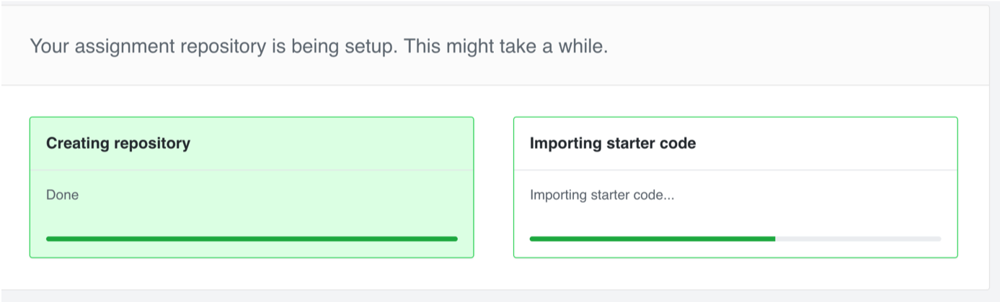
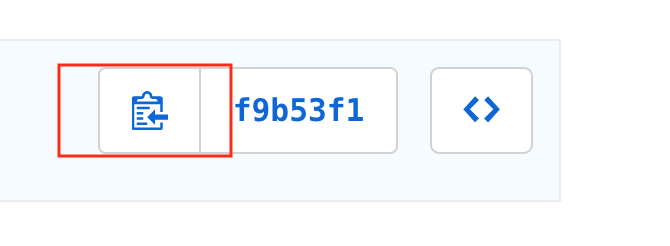

## Programming Assignments

Much of the homework that you will have in this class will involve a programming assignment of some sort. In order to streamline the submission process for this class, as well as to make it easier to grade, we have decided to use github to store all code related to your assignment. Here is the process that you will use to submit your homework. We will also go over this submission process in class to make sure that everyone understands all of the submission processes.

### 1. Create a repository 

Each time an assignment is released, it will be made available via a link that will be sent out email and posted on sakai under the assignments tab. Once you have received the link, click on it and it should create your own repository with the starter code and instructions for the assignment. It should look something like this:

Afterwards, you should now have access to a repository for you to access the homework code and assignments. Modify this code to complete the assignment and use the git workflow to submit your changes to the remote repository (We will cover this in class). 

### 2. Submit your commit hash to Sakai 

When you feel that you are finished with your assignment, you will need to submit what is known as your "commit hash" to sakai. When you feel that you are finished, go to your remote repository on github and click on the commit button:

Then, click the clipboard, (or the hash itself and copy the full hash) and paste that hash into the Sakai submisison box.

If you do not do this, we will take the last commit as of the deadline. If you are submitting late (see the Syllabus for late policy), please submit the hash that you would like us to grade at. 

